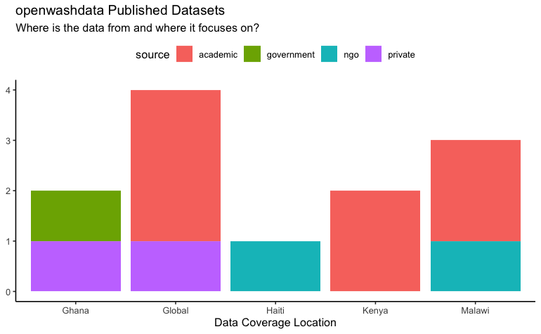

We are reaching to the 10th newsletter! The community is growing and we are happy to have a brief review on what datasets we have achieved so far! Also a new tutorial blog and a new team member 👏

## 🥰 openwashdata: 12 datasets, 5 developers, and 38 collaborators!

Since the launch of openwashdata, we published 12 datasets shared from diverse sources: academic research, government open data, NGO, and private data donators. We published different types of data too, such as

-   engineering (e.g., waterpumpkwale, grdwtrsmpkwale)

-   monitoring (e.g., rwpfunctionality, cbssuitabilityhaiti, wasteskipsblantyre)

-   qualitative data (e.g, gdho, chckapmalawi, cleanteamghana, biogasoutcomesmalawi)

and so on... Thanks for all data contributors who make this possible and stay tuned for more exciting open WASH datasets! If you are interested, consider to [share your WASH data with us](https://github.com/openwashdata/data).

## openwashdata Blog: Creating and visualizing maps of WASH data (II)

What if our data only contains geographical information like countries or regions? This second blog tutorial will guide you to combine your data with useful external geographical data to plot the maps. We walk you through with an example on drawing the global distribution of humanitarian organizations with openwashdata package [`gdho`](https://github.com/openwashdata/gdho/).

[Continue to read here](https://openwashdata.org/pages/blog/posts/2024-03-01-create-map-part-2/)

## Contributor of the Month

Welcome to our new team member [Colin Walder](https://openwashdata.org/about/colin/) who will work on openwashdata partnerships and educational events. He will also contribute on improving packages for accessing data from the Joint Monitoring Programme (JMP) by WHO/UNICEF. Welcome to the openwashdata community!

## Get Involved

We truly believe that openwashdata project prospers when we have **YOU** work together and promote open science and data practice! No matter what background you are from, we come up with some ways for you to get involved:

-   [Join our chatroom to meet people!](https://openwashdata.org/pages/get-started/chat/)
-   [Share your WASH data with us](https://github.com/openwashdata/data)
-   Spread the word. Forward this email.
-   Got more ideas? [Leave us a message on Matrix to collaborate!](https://matrix.to/#/%23openwashdata-lobby:staffchat.ethz.ch)
