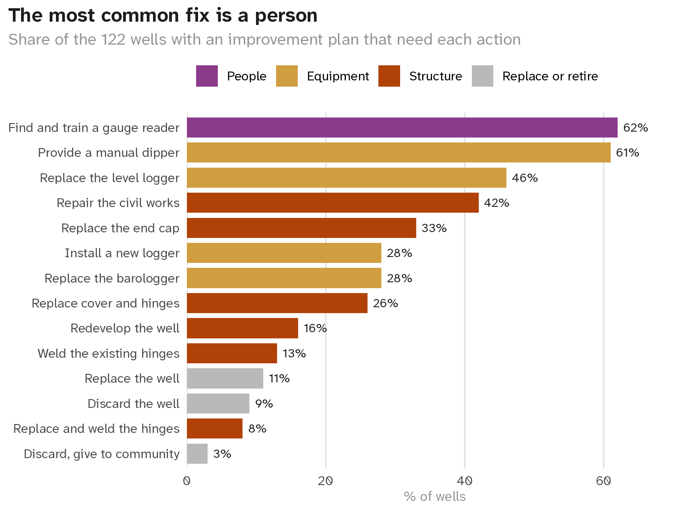

[View this email in your browser]({{ email_url }})

Welcome back to our newsletter! This month's dataset of the month comes from BASEflow Malawi and looks at the state of 123 groundwater monitoring wells. Our blog tells how the solidwastekampala package went from a raw spreadsheet to a published data package in 33 hours, and how we used AI along the way. We also thank Emmanuel Mhango as our contributor of the month.

## Dataset of the Month: gwinfraassess

gwinfraassess holds an assessment of 123 groundwater monitoring wells in Malawi, carried out by BASEflow Malawi in 2022 and 2023. For each well, field teams recorded the depth and the water level, the state of the automatic water level logger, the measuring equipment, how the community relates to the well, and what the well needs to keep working.

Every well but one has an improvement plan. The action named most often is a trained person to read the gauge, in 76 of 122 wells, followed by a manual dipper in 74 wells. Many wells have a logger, but on the day of the assessment the data could be downloaded from only 10 of 67 loggers.

- `gwinfraassess` - <https://openwashdata.github.io/gwinfraassess>: Groundwater Monitoring Wells, Nkhotakota, Malawi 2022-2023

123 observations \| Malawi \| CC BY 4.0 \| <https://openwashdata.github.io/gwinfraassess>

### Our question for you

In the Malawi wells, the most common need was a person trained to read the gauge. We would like to know how this looks in your work. Choose one answer with a click, and we will share the results in the next issue.

**What is the biggest gap in the monitoring data you work with?**

{{ survey.monitoring-gap }}

## Blog Highlights: from a raw spreadsheet to a published data package

In July, the household waste data from Kampala that we featured last month arrived as an Excel workbook with merged headers, summary rows and the typos of manual data entry. 33 hours later it was a reviewed and citable R data package with a DOI. The new post retells those hours from the record the repository keeps, including every prompt we sent to the AI. Data cleaning took about one hour of the nine hours of work, and the post shows where the rest went.

The post ends with a statement of how we used AI for the package and for the post itself. We want to make such statements a standard part of our work.

- [From a raw spreadsheet to a published data package in 33 hours](https://openwashdata.org/pages/blog/posts/2026-10-20-solidwastekampala-story/)

## Contributor of the Month

Our contributor of the month is Emmanuel Mhango, Data Steward at BASEflow Malawi and the author of this month's dataset. Emmanuel has published more than ten WASH datasets with openwashdata, and his two reflections on his year as Data Steward were in our last issue. Thank you, Emmanuel.

## Get Involved

We believe the openwashdata project prospers when we have **YOU** work together and promote open science and data practice! No matter what background you are from, we come up with some ways for you to get involved:

- [Join our chatroom to meet people!](https://openwashdata.org/pages/get-started/chat/)
- [Share your WASH data with us](https://openwashdata.org/pages/blog/posts/2024-05-17-data-publication-1/)
- Spread the word. Forward this email.
- Got more ideas? [Leave us a message on Matrix to collaborate!](https://matrix.to/#/%23openwashdata-lobby:staffchat.ethz.ch)
